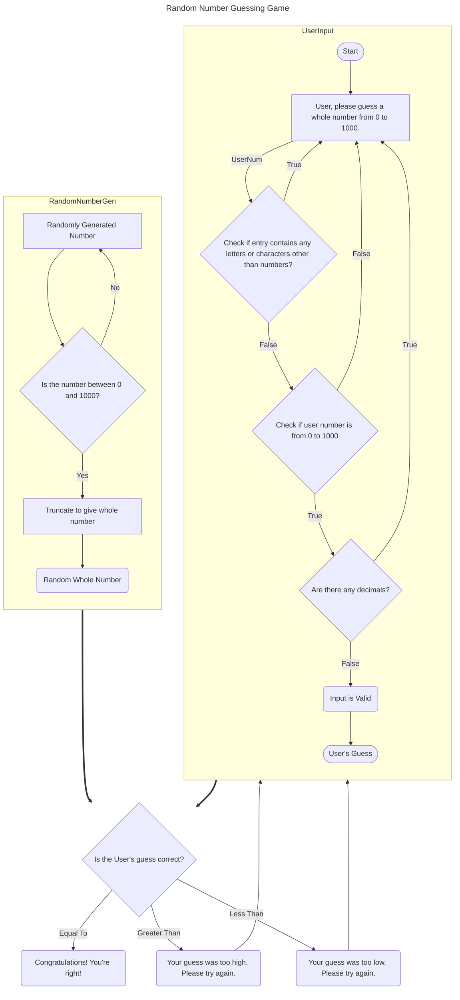

## Flowchart description
1. Generate a random number with these conditions:
    * Must be between 0 and 1000
    * Must be a whole number
2. Request User's guess of a number
    * Check if user's input is valid
        * Is it a number?  Meaning no letters or characters.
        * Is it a whole number?
        * Is it between 0 and 1000?
3. Compare user's guess to generated number
    * If the guess is the same as the random number, respond with "Congratulations! You're right!"
    * If the guess is too high, respond with "Your guess was too high." and ask them for a new number.
    * If the guess is too low, respond with "Your guess was too low." and ask them for a new number.